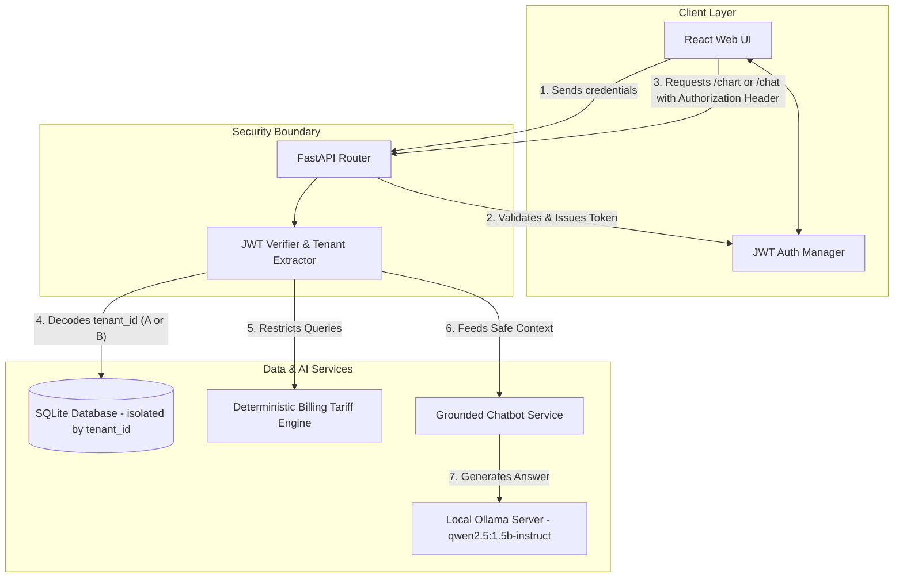

# Cortex Copilot - Industrial Energy Platform AI Assistant

Cortex Copilot is a self-hosted, secure, multi-tenant AI assistant designed for an Industrial Intelligence Platform. It allows factory operators to ask questions about energy consumption in natural language, querying telemetry databases and explaining charts deterministically while strictly preventing data hallucinations and cross-tenant leakage.

---

## 1. System Architecture

Below is the design showing how the components interact securely under strict tenant boundaries.

---

## 2. Model Choice & Rationale

* **Model Used:** `qwen2.5:1.5b-instruct` (or `qwen2.5:3b-instruct` depending on environment setup).
* **Rationale:**
  1. **Low Compute footprint:** Fits easily on standard modern CPUs or low-tier GPUs, making local, self-hosted execution via Ollama fast and viable.
  2. **Excellent Instruction-Following:** Excels at respecting strict system prompt constraints, making it highly reliable for refusing out-of-bounds questions instead of hallucinating.
  3. **Natural Language Generation:** Explains complex telemetry parameters (like Total Harmonic Distortion and Power Factor) in clear, plain-English definitions.

---

## 3. Fine-Tuning & Prompt Grounding Details

Rather than expensive weight-adjustment training, we utilized **Contextual Prompt Grounding** and **Input Sanitation Guards**:
1. **Date-Boundary Guard:** A regex checker scans user chat queries for date patterns. If the user asks for years or dates outside our dataset (`2026-05-19` to `2026-07-04`), the backend immediately rejects the request with a deterministic refuse message.
2. **Strict RAG Context Injection:** When a query is validated, the backend runs pre-defined SQLite queries (e.g. `get_low_pf_events` or `get_thd_metrics`) to extract actual data points. These statistics are loaded into a locked system prompt.
3. **Structured Mappings:** Explicit guidelines are configured for voltage, current, THD, and anomalies, forcing the LLM to refuse general questions that don't match the active database rows.

---

## 4. Anomalies Discovered in the Mock Data

The following anomalies are embedded within the SQLite telemetry logs and are dynamically surfaced to the user:

| Tenant | Timestamp (UTC/Local) | Metric | Anomalous Value | Impact / Consequence |
| :--- | :--- | :--- | :--- | :--- |
| **Tenant A** | `2026-06-03 14:00` | Power Factor | **0.72** | Dropped far below the standard 0.95 threshold. Results in reactive power (kVAR) surges and low-PF bill surcharges. |
| **Tenant A** | `2026-06-18 10:15` | Voltage THD (Phase R) | **8.2%** | Exceeded the 5.0% IEEE-519 limit. Triggers overheating, grid instability, and transformer noise. |
| **Tenant B** | `2026-06-03 14:00` | Power Factor | **0.81** | Low power factor event causing increased load on the sub-metered segment. |
| **Tenant A/B**| `2026-07-04` (Peak) | Apparent Power | **~1,438.21 kVA** | Near the 1,501 kVA Contract Demand threshold. Exceeding this triggers a penal demand charge of ₹1,000/kVA/month. |

---

## 5. How Tenant B Was Derived

* **Tenant B** represents a secondary industrial sub-metered factory segment. 
* We parsed the unified database telemetry logs by filtering database rows strictly by the column value `tenant_id = 'B'`.
* Credentials and tokens are fully segregated so Tenant B's operator only receives their corresponding sub-metered telemetry profiles.

---

## 6. Tenant Credentials for Judges

Use the following logins to test the multi-tenant dashboard and chatbot interfaces:

* **Tenant A (Commercial/Industrial Segment):**
  * **Username:** `tenant_a`
  * **Password:** `password_a`
* **Tenant B (Secondary Sub-metered Segment):**
  * **Username:** `tenant_b`
  * **Password:** `password_b`

---

## 7. Known Limitations

1. **SQLite Write Concurrency:** SQLite is file-based and not optimized for high-volume concurrent writes. For production time-series ingestion, a database like TimescaleDB/PostgreSQL should be used.
2. **Local LLM Performance:** LLM inference latency depends on the host machine's hardware. On CPU-only hosts, responses may take 5–10 seconds.
3. **Static Tariffs:** The TGSPDCL HT CAT. 1A active tariff configuration is hardcoded in the billing service. It needs a GUI database manager to edit pricing dynamic tables.

---

## 8. Roadmap: What We Would Do With 2 More Weeks

1. **Live Telemetry Stream:** Build a WebSocket server inside FastAPI to stream raw telemetry logs (every 1 second) and animate gauges on the dashboard UI.
2. **Dynamic Alerting Rules:** Add user-configurable threshold rules (e.g. *"Email me if THD exceeds 4% for 3 straight intervals"*).
3. **Modbus TCP Translator:** Build a gateway plugin to read directly from physical Schneider/Siemens electrical meters using Modbus TCP or RTU protocols.
4. **Custom-Trained LoRA:** Fine-tune a LLaMA-based model on grid standard manuals (like IEEE-519 and grid codes) to improve conversational fault diagnosis.
